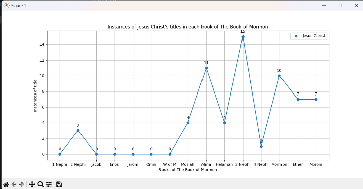
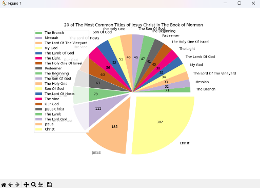
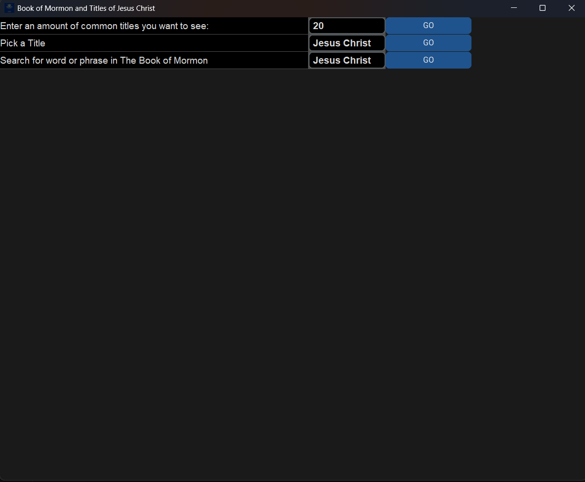
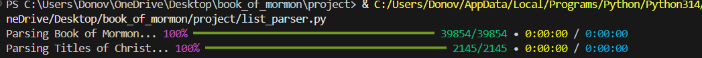

# Book of Mormon Search and Analysis Tool

Donovan Mortenson  
CS 111 - Free Coding Project

## Overview
For my free coding project, I will be creating a tool for searching the Book of Mormon. I will be creating three search tools:

1. The first will look through the Book of Mormon for names/titles of Christ, count how many instances there are, and create a pie chart based on the results.
2. The second tool will take a title/name of Christ and create a line chart of how often that title is found in the Book of Mormon and in which books it is found most often.
3. The third tool will prompt the user for a word or phrase and show the user where it appears in the Book of Mormon.

## Libraries Imported and Downloaded
- Rich - Used to display progress bars while running scripts
- Matplotlib - Used to generate pie charts and line charts
- Ctypes - Used to darken the title bar for the GUI
- Tkinter - Used to generate the GUI
- Customtkinter - Used to make the GUI more modern

## Files Used
- `book_of_mormon.txt` - A `.txt` version of the Book of Mormon. When the program "looks through" the Book of Mormon, it is searching this file.
- `book_of_mormon.ico` - An icon of the Book of Mormon used on the GUI window.
- `titles_of_christ.txt` - A list of 2067 titles/references/names of Jesus Christ that the program searches for when looking through the Book of Mormon.
- `chosen_titles.txt` - A list of titles of Christ from `titles_of_christ.txt` that have been picked by the user.

## Images of Project

  

  

  

  

